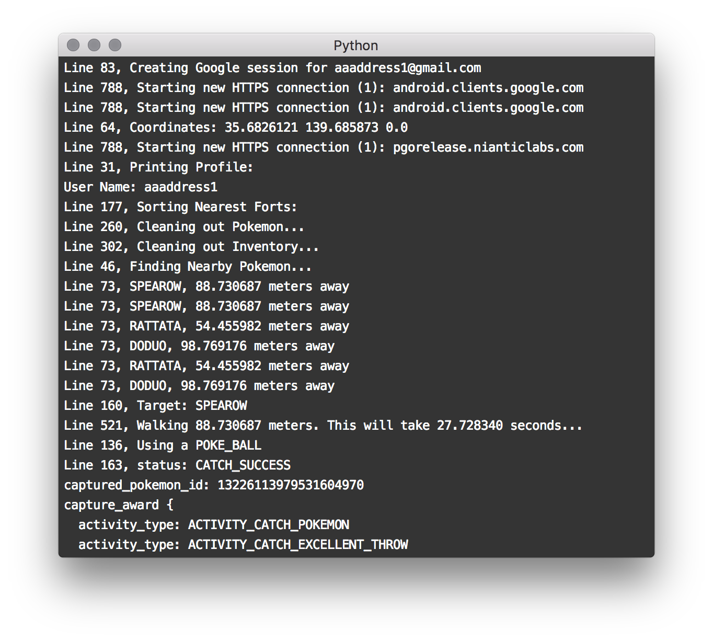

# PykemonGo
Play PokémonGo without hands, Based on Python, and Easy to fix.

### How To Use

0. Open your terminal
1. `git clone https://github.com/aaaddress1/PykemonGo`
2. `cd ./PyKemonGo`
3. `pip install -r ./requirements.txt`
4. `cd ./pogo/`
4. `vim data.config` and input your account information and location you want.
5. `python main.py`
6. Cheers!

